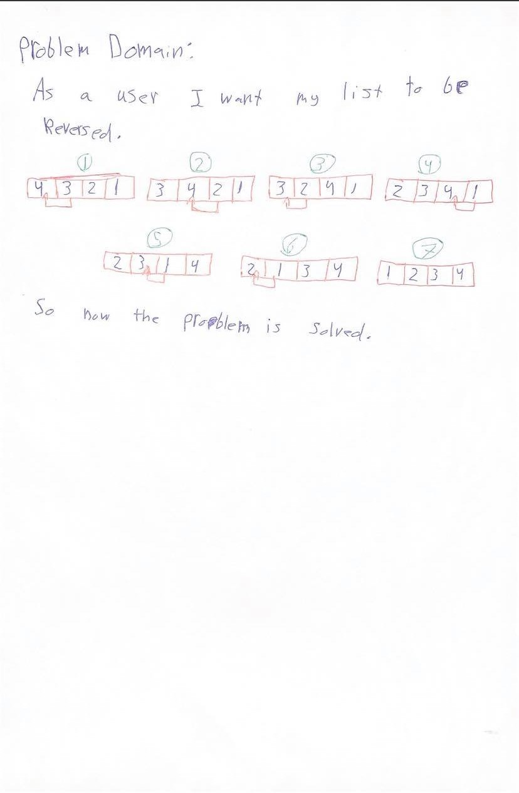
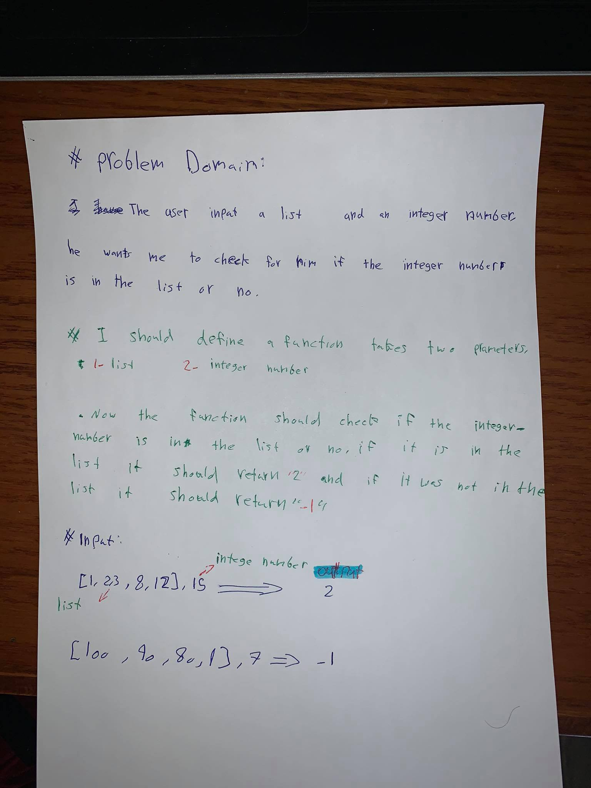

# Data Structures and Algorithms

See [setup instructions](https://codefellows.github.io/setup-guide/code-301/3-code-challenges), in the Code 301 Setup Guide.

## Repository Quick Tour and Usage

### 301 Code Challenges

Under the `data-structures-and-algorithms` repository, at the top level is a folder called `code-challenges`

Each day, you'll add one new file to this folder to do your work for the day's assigned code challenge

# 401 Data Structures, Code Challenges

- Please follow the instructions specific to your 401 language, which can be found in the directory below, matching your course.

### Python 401, Code Challenges

# Reverse an Array:
<!-- Short summary or background information -->
- The challenge is about reversing, for example we have a list it contains [1,2,3,4,5] we want to reverse it to [5,4,3,2,1].

### Challenge:
<!-- Description of the challenge -->
- The challenge about reversing a list .

### Approach & Efficiency:
<!-- What approach did you take? Why? What is the Big O space/time for this approach? -->
- I used the slice. Because you can reverse strings and integers

### Solution:
<!-- Embedded whiteboard image -->

<!-- ------------------------------------------------- -->
# Shift and Array:
<!-- Short summary or background information -->
- The challenge is about shifting and sorting, for example we have in input "[2,4,6,8], 5" and  we want to do it to [2,4,5,6,8].

### Challenge:
<!-- Description of the challenge -->
- The challenge about insert and sorting .

### Approach & Efficiency:
<!-- What approach did you take? Why? What is the Big O space/time for this approach? -->
- I created an empty list and added to it the list in the input, added the number which is outside the list and sorted the list.

### Solution:
<!-- Embedded whiteboard image -->

<!-- ------------------------------------------------- -->
# Array-binary-search:
<!-- Short summary or background information -->
- The challenge is about searching in a list,search if integer number in the list or no,  for example we have an input "[4,8,15,16,23,42], 15" it should return 2. Because number 15 is the list
### Challenge:
<!-- Description of the challenge -->
- The challenge is about searching in a list, and if the integer number matches the list I am searching for, it should return 2 other than that it is should return -1.

### Approach & Efficiency:
<!-- What approach did you take? Why? What is the Big O space/time for this approach? -->
- I declared a function, which checks if they integer number in the list or no.

### Solution:
<!-- Embedded whiteboard image -->
