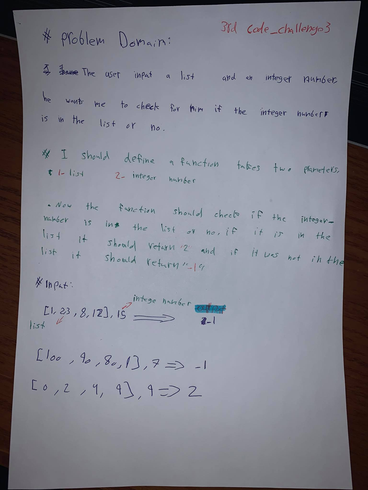
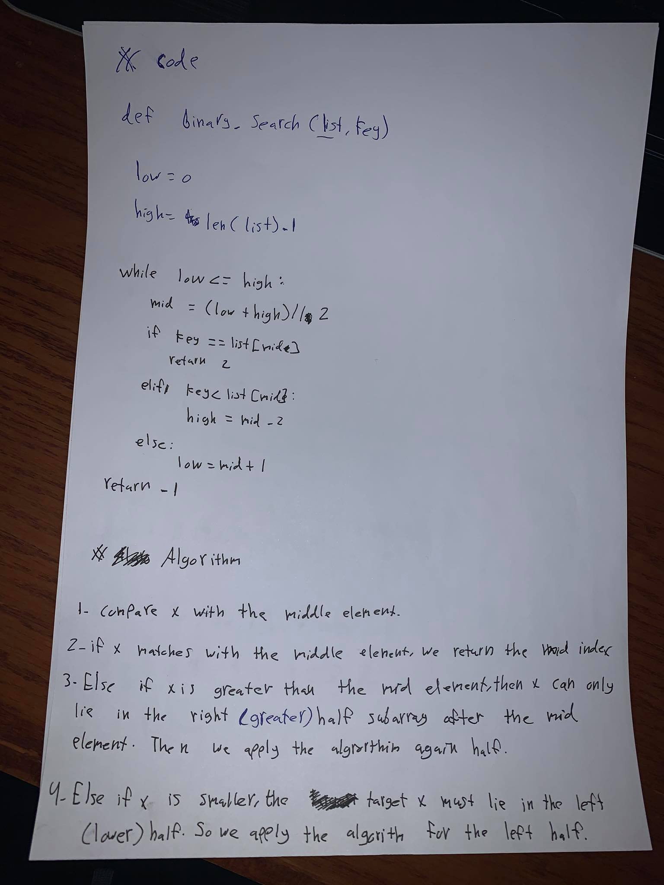

# Array-binary-search:
<!-- Short summary or background information -->
- The challenge is about searching in a list,search if integer number in the list or no,  for example we have an input "[4,8,15,16,23,42], 15" it should return 2. Because number 15 is the list
### Challenge:
<!-- Description of the challenge -->
- The challenge is about searching in a list, and if the integer number matches the list I am searching for, it should return 2 other than that it is should return -1.

### Approach & Efficiency:
<!-- What approach did you take? Why? What is the Big O space/time for this approach? -->
- I declared a function, which checks if they integer number in the list or no.

### Solution:
<!-- Embedded whiteboard image -->

