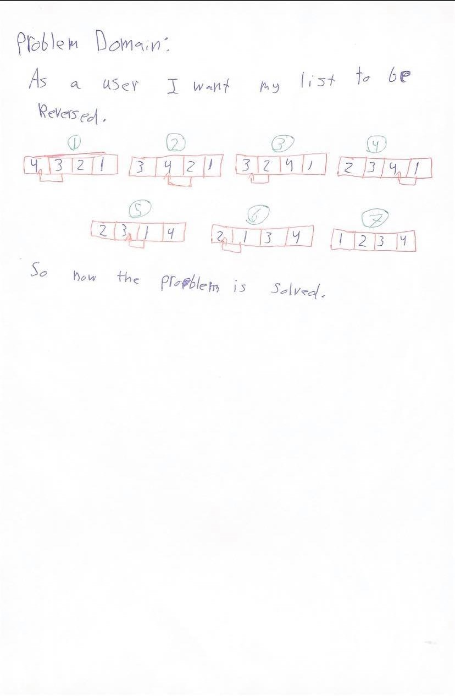

# Reverse an Array:
<!-- Short summary or background information -->
- The challenge is about reversing, for example we have a list it contains [1,2,3,4,5] we want to reverse it to [5,4,3,2,1].

### Challenge:
<!-- Description of the challenge -->
- The challenge about reversing a list .

### Approach & Efficiency:
<!-- What approach did you take? Why? What is the Big O space/time for this approach? -->
- I used the slice. Because you can reverse strings and integers

### Solution:
<!-- Embedded whiteboard image -->
