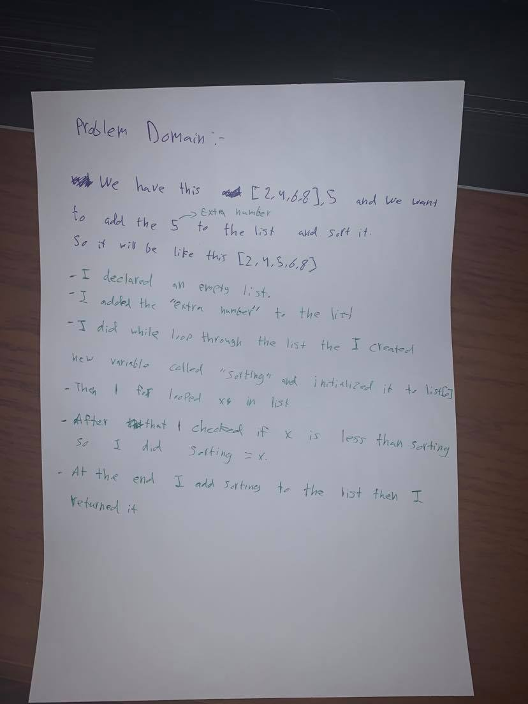

# Shift and Array:
<!-- Short summary or background information -->
- The challenge is about shifting and sorting, for example we have in input "[2,4,6,8], 5" and  we want to do it to [2,4,5,6,8].

### Challenge:
<!-- Description of the challenge -->
- The challenge about insert and sorting .

### Approach & Efficiency:
<!-- What approach did you take? Why? What is the Big O space/time for this approach? -->
- I created an empty list and added to it the list in the input, added the number which is outside the list and sorted the list.

### Solution:
<!-- Embedded whiteboard image -->

