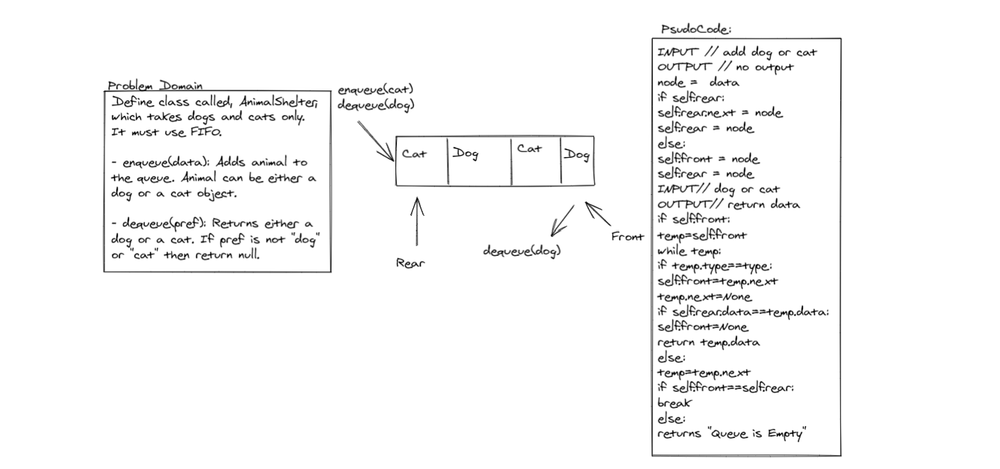

# Queue-with-animal.

<!-- Short summary or background information -->
- Define a class called Animalshelter, which takes dogs and cats, It must use FIFO.

- enqueue(value) which inserts value into the PseudoQueue, using a first-in, first-out approach.
dequeue() which extracts a value from the PseudoQueue, using a first-in, first-out approach.
The Stack instances have only push, pop, and peek methods. You should use your own Stack implementation. Instantiate these Stack objects in your PseudoQueue constructor.

### Challenge:
<!-- Description of the challenge -->
- enqueue(data): Adds animal to the queue. Animal can be either a dog or a cat object.
- dequeue(pref): Returns either a dog or a cat. If pref is not "dog" or "cat" then return null.

### Approach & Efficiency:
<!-- What approach did you take? Why? What is the Big O space/time for this approach? -->
- enqueue(data) = > time o(1) space o(1)

- dequeue(pref) => time o(n) space o(1)

### Solution:
<!-- Embedded whiteboard image -->
## [Queue-with-animal Code](fifo_animal_shelter.py)

