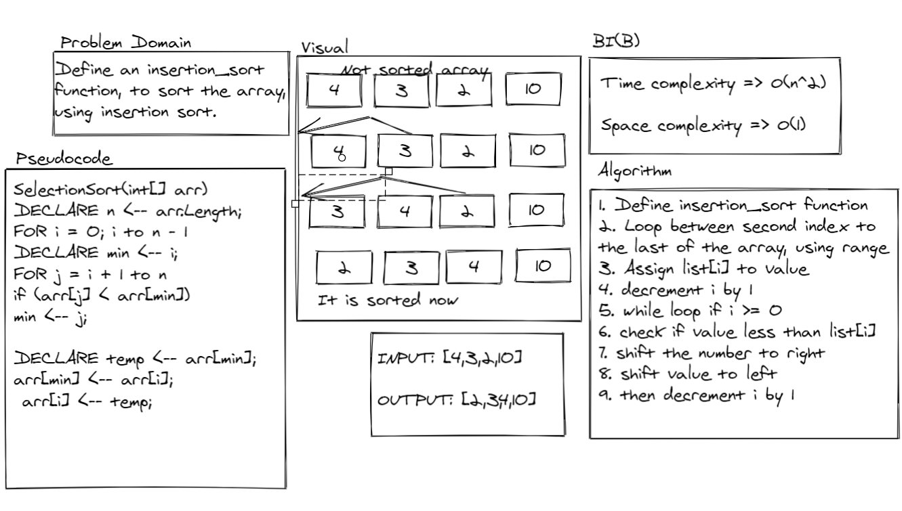

# Code 

def insertion_sort(list):

    for i in range(1, len(list)):

        value = list[i]
        i -= 1
        
        while i >= 0:
            if value < list[i]:
                
                list[i+1] = list [i] # shifts the number i to right by i +1
                list[i] = value # shifts the value to left into i
                i -= 1
            else:
                break
    return list

a = [20,18,12,8,5,-2]

insertion_sort(a)

print(a)

------------------

# Test

from challenges.insertion_sort.insertion_sort import insertion_sort

def test_insertion_sort():

    actual = insertion_sort([5,2,6,0])
    excpected = [0, 2, 5, 6]
    assert excpected == actual

def test_insertion_sort2():

    actual = insertion_sort([20,18,12,8,5,-2])
    excpected = [-2, 5, 8, 12, 18, 20]
    assert excpected == actual

def test_insertion_sort3():

    actual = insertion_sort([5,12,7,5,5,7])
    excpected = [5, 5, 5, 7, 7, 12]
    assert excpected == actual

def test_insertion_sort4():

    actual = insertion_sort([2,3,5,7,13,11])
    excpected = [2, 3, 5, 7, 11, 13]
    assert excpected == actual

