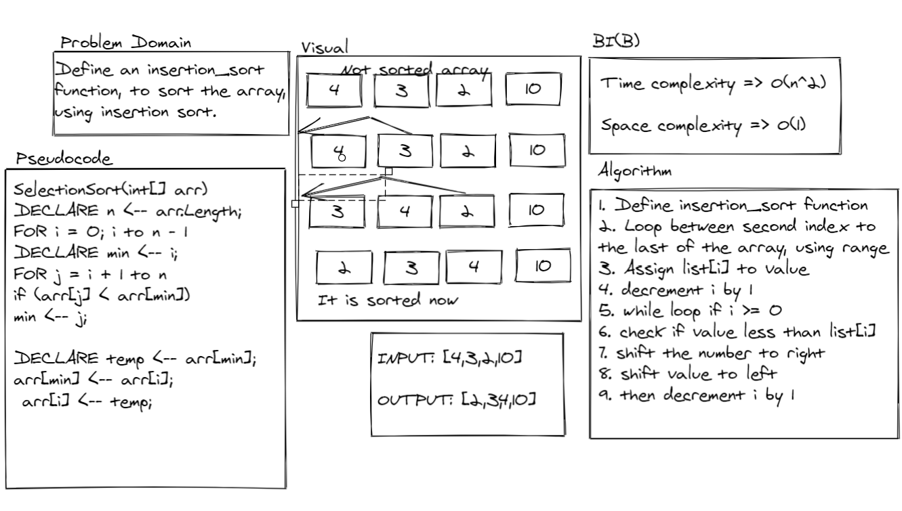

# Insertion Sort:
<!-- Short summary or background information -->
- Define an insertion_sort function, to sort the array, using insertion sort.

### Challenge:
<!-- Description of the challenge -->
- To sort the array.

### Approach & Efficiency:
<!-- What approach did you take? Why? What is the Big O space/time for this approach? -->
- Time complexity => O(n^2)
- Space complexity => O(1)

### Solution:
<!-- Embedded whiteboard image -->

- [Insertion_sort](insertion_sort.py)