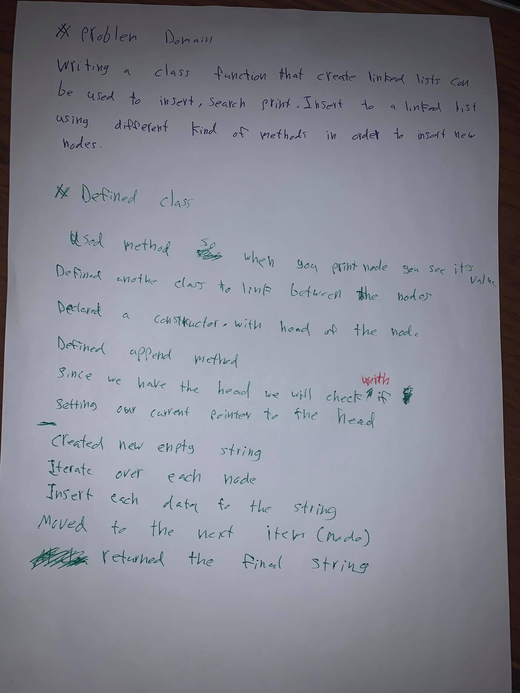
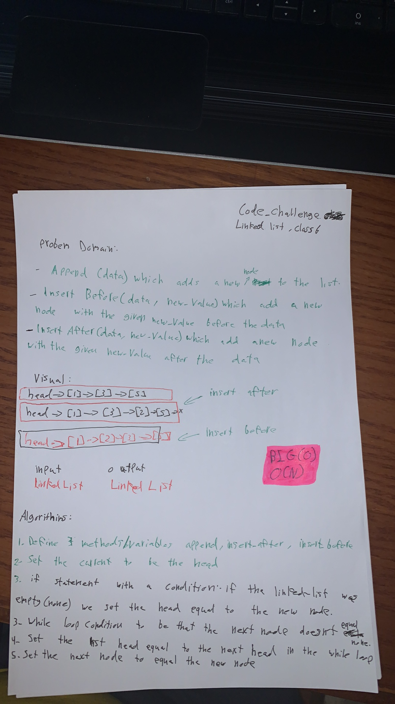
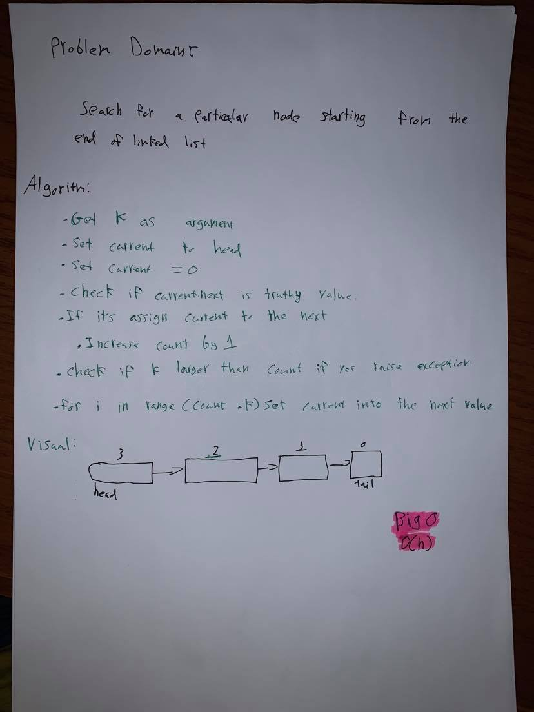

# Linked List:
<!-- Short summary or background information -->
- The challenge is about a Linked List is a sequence of Nodes that are connected/linked to each other. The most defining feature of a Linked List is that each Node references the next Node in the link.

### Challenge:
<!-- Description of the challenge -->
- Create a Node class that has properties for the value stored in the Node, and a pointer to the next Node. Within the LinkedList class, include a head property. Upon instantiation, an empty Linked List should be created.

### Approach & Efficiency:
<!-- What approach did you take? Why? What is the Big O space/time for this approach? -->
- Singly Linked List.
- O(1) Time/space performance for insert method.
- O(n) Time and O(1) space performance for includes method.

### Solution:
<!-- Embedded whiteboard image -->

- [Code of Linked List](linked_list.py)

# ll-Insertions to Linked List:
<!-- Short summary or background information -->
- Append to a linked list, so the number you are appending to will be added to the end of the ll.
- Insert before and after the ll.

### Challenge:
<!-- Description of the challenge -->
- Creating methods to insert to the ll before and after, or appending to it.

### Approach & Efficiency:
<!-- What approach did you take? Why? What is the Big O space/time for this approach? -->
- Before and after, it will be a while loop. To search for the data then insert new_value before or after it depends on the function. And to append it will while loop to end and append the new value.

### Solution:

<!-- Embedded whiteboard image -->

- [Code of appending, insertion to Linked List](linked_list.py)

# lll-Insertions to Linked List:
<!-- Short summary or background information -->
- Method which takes a number, k as a parameter. Return the node's value which is k from the end of the linked list 
- Insert before and after the ll.

### Challenge:
<!-- Description of the challenge -->

### Approach & Efficiency:
<!-- What approach did you take? Why? What is the Big O space/time for this approach? -->
- O(n)

### Solution:

<!-- Embedded whiteboard image -->

- [Code of appending, insertion to Linked List](linked_list.py)
