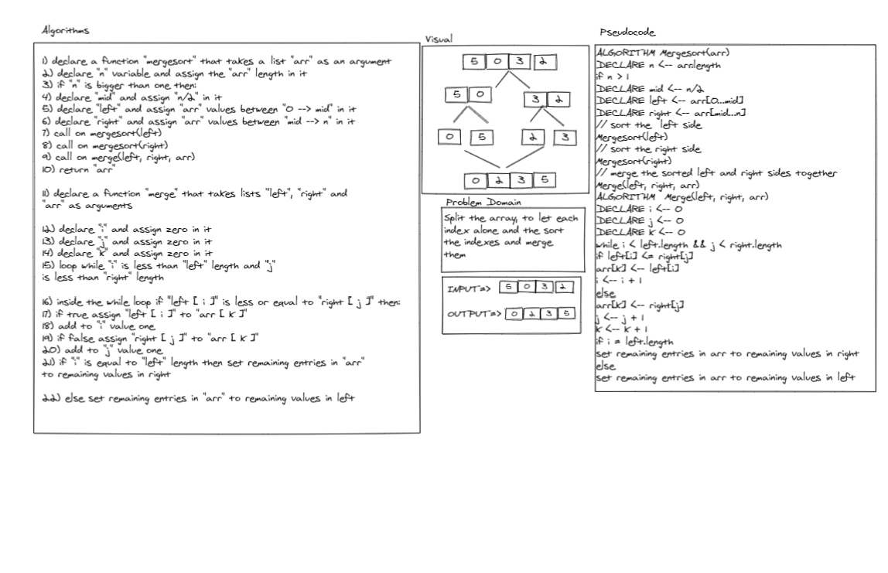

# Code 

def merge_sort(list):

  n = len(list)

  if n > 1:

    m = int(n/2)
    l = list[0:m]
    r = list[m:n]
    merge_sort(l)
    merge_sort(r)
    merge(l, r, list)
  return list

def merge(l, r, list):
  
  i = 0
  
  j = 0
  
  k = 0
  
  while i < len(l) and j < len(r):
  
    if l[i] <= r[j]:
        list[k] = l[i]
        i = i + 1
    else:
        list[k] = r[j]
        j = j + 1  
    k = k + 1
  if i == len(l):
  
    while j < len(r):
      list[k] = r[j]
      j += 1
      k += 1
  else:
  
    while i < len(l):
      list[k] = l[i]
      i += 1
      k += 1

------------------

# Test

from challenges.merge_sort.merge_sort import merge_sort

def test_merge_sort():

    actual = merge_sort([5,2,6,0])
    excpected = [0, 2, 5, 6]
    assert excpected == actual

def test_merge_sort2():

    actual = merge_sort([20,18,12,8,5,-2])
    excpected = [-2, 5, 8, 12, 18, 20]
    assert excpected == actual

def test_merge_sort3():

    actual = merge_sort([5,12,7,5,5,7])
    excpected = [5, 5, 5, 7, 7, 12]
    assert excpected == actual

def test_merge_sort4():

    actual = merge_sort([2,3,5,7,13,11])
    excpected = [2, 3, 5, 7, 11, 13]
    assert excpected == actual

