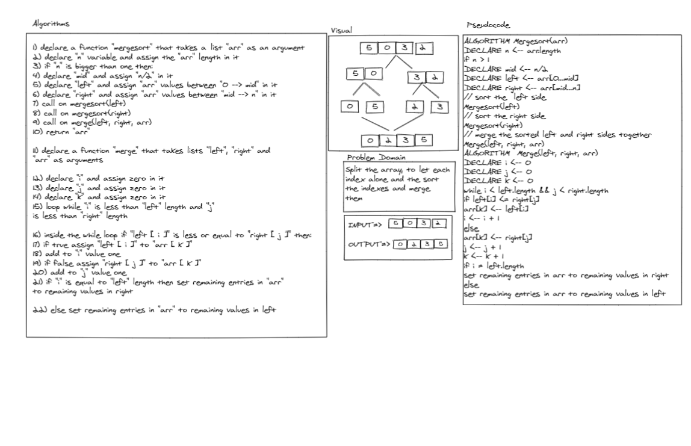

# Merge Sort:
<!-- Short summary or background information -->
- Define an merge_sort function, split the array then sort it.

### Challenge:
<!-- Description of the challenge -->
- Splitting the array then to sort the array.

### Approach & Efficiency:
<!-- What approach did you take? Why? What is the Big O space/time for this approach? -->
- Space complexity => O(n)
- Time complexity => O(nlogn)

### Solution:
<!-- Embedded whiteboard image -->

- [Merge_sort](merge_sort.py)