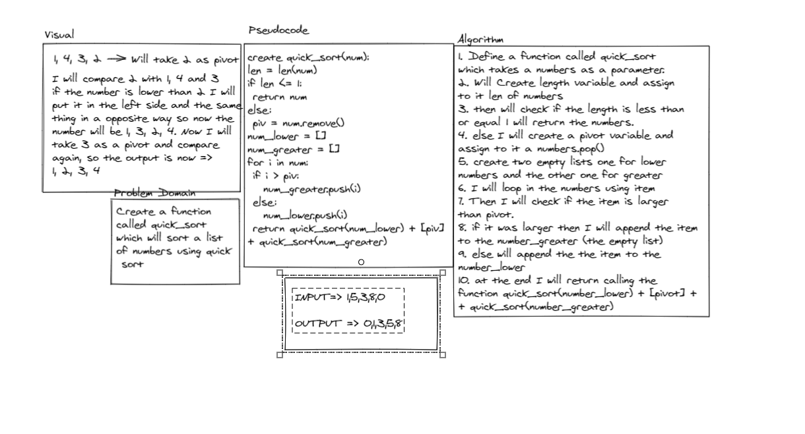

# Code 

def quick_sort(numbers):

    length = len(numbers)
    if length <= 1:
        return numbers
    else:
        pivot = numbers.pop()

    numbers_lower = []
    numbers_greater = []

    for item in numbers:
        if item > pivot:
            numbers_greater.append(item)

        else:
            numbers_lower.append(item)

    return quick_sort(numbers_lower) + [pivot] + quick_sort(numbers_greater)

print(quick_sort([7,6]))

------------------
# Tracing the code

------------------

# Test

from challenges.quick_sort.quick_sort import quick_sort

def test_quick_sort():

    actual = quick_sort([5,2,6,0])
    excpected = [0, 2, 5, 6]
    assert excpected == actual

def test_quick_sort2():

    actual = quick_sort([20,18,12,8,5,-2])
    excpected = [-2, 5, 8, 12, 18, 20]
    assert excpected == actual

def test_quick_sort3():

    actual = quick_sort([5,12,7,5,5,7])
    excpected = [5, 5, 5, 7, 7, 12]
    assert excpected == actual

def test_quick_sort4():

    actual = quick_sort([2,3,5,7,13,11])
    excpected = [2, 3, 5, 7, 11, 13]
    assert excpected == actual

