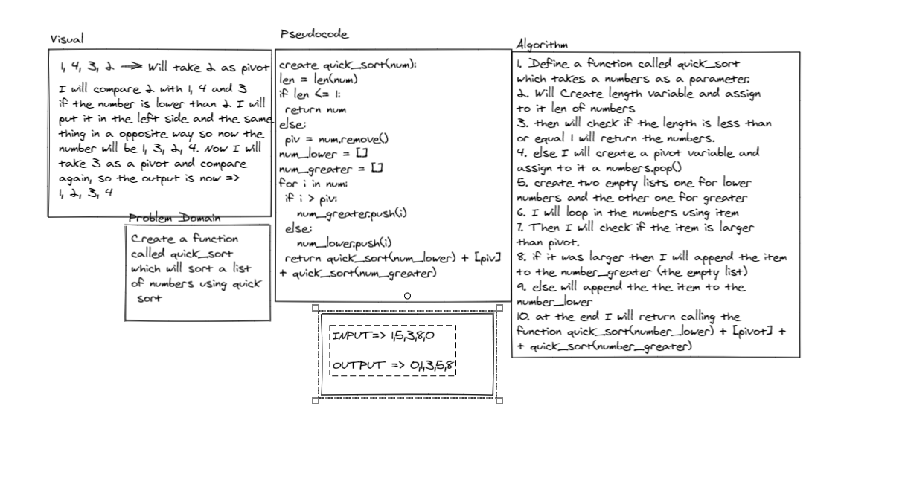

# Quick Sort:
<!-- Short summary or background information -->
- Define an quick sort function, to sort the numbers.

### Challenge:
<!-- Description of the challenge -->
- Sort the numbers.

### Approach & Efficiency:
<!-- What approach did you take? Why? What is the Big O space/time for this approach? -->
- 
- 

### Solution:
<!-- Embedded whiteboard image -->

- [Quick_sort](quick_sort.py)