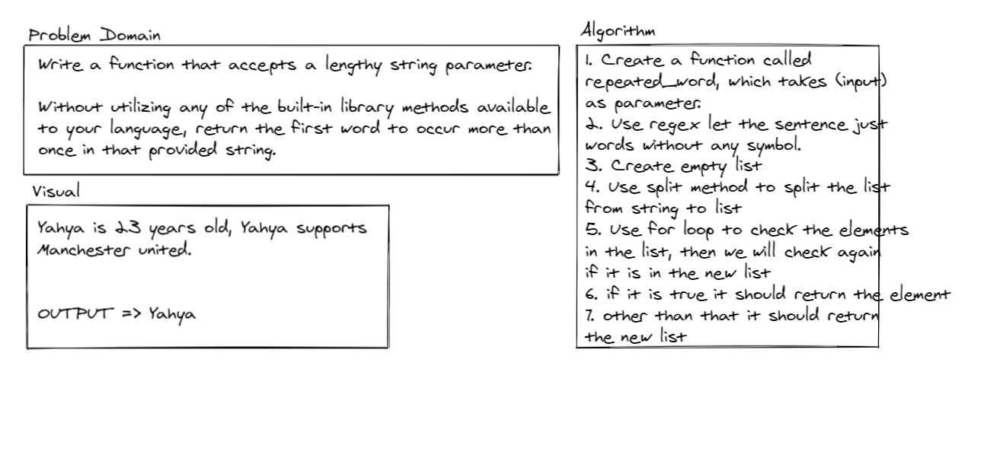

# Repeated word:
<!-- Short summary or background information -->
- Define an Repeated word function, to find the first repeated word.

### Challenge:
<!-- Description of the challenge -->
- Check the whole sentence and the output should be the first repeated word.
- Write a function that accepts a lengthy string parameter.
- Without utilizing any of the built-in library methods available to your language, return the first word to occur more than once in that provided string.

### Approach & Efficiency:
<!-- What approach did you take? Why? What is the Big O space/time for this approach? -->
- Time Complexity O(n)
- Space Complexity O(n)

### Solution:
<!-- Embedded whiteboard image -->

- [repeated_word](repeated_word.py)