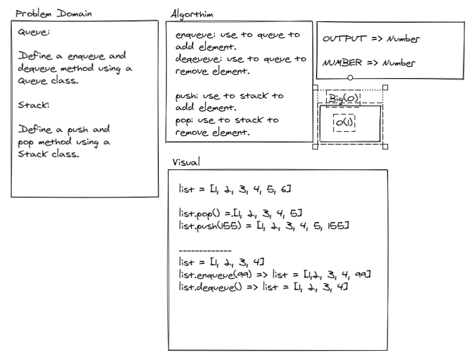
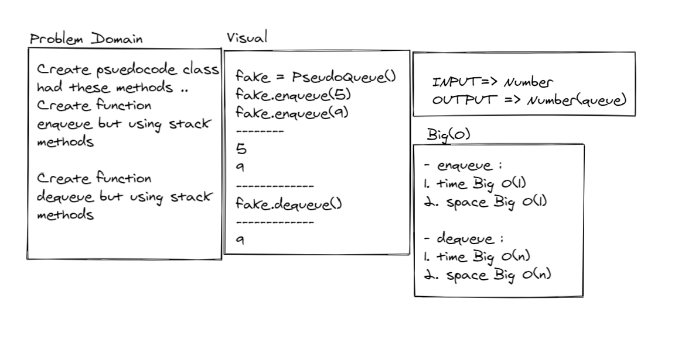

# Stacks and Queues.

<!-- Short summary or background information -->
- A stack is data structure, you can push or pop from it. Push => add after the last element, Pop => deletes the last element, and it has more than these functionality. Stack is like LIFO

- A queue is a data structure, you can enqueue or dequeue from it. enqueue => add in the first element, dequeue => deletes the first element. Queue is like FIFO

### Challenge:
<!-- Description of the challenge -->
- To successfully push onto a stack.
- To successfully pop off the stack.
- To successfully empty a stack after multiple pops.
- To successfully peek the next item on the stack.
- Calling pop or peek on empty stack raises exception.
- To successfully enqueue into a queue.
- To successfully dequeue out of a queue the expected value.
- To successfully peek into a queue, seeing the expected value.
- To successfully empty a queue after multiple dequeues.
- Calling dequeue or peek on empty queue raises exception.

### Approach & Efficiency:
<!-- What approach did you take? Why? What is the Big O space/time for this approach? -->
- Push O(1)
- Pop (1)
- Enqueue O(1)
- Dequeue (1)

### Solution:
<!-- Embedded whiteboard image -->
### [Code of stacks_and_queues](stacks_and_queues.py)

# Queue-with-stacks.

<!-- Short summary or background information -->
- Create a brand new PseudoQueue class. Do not use an existing Queue. Instead, this PseudoQueue class will implement our standard queue interface (the two methods listed below), but will internally only utilize 2 Stack objects. Ensure that you create your class with the following methods:

- enqueue(value) which inserts value into the PseudoQueue, using a first-in, first-out approach.
dequeue() which extracts a value from the PseudoQueue, using a first-in, first-out approach.
The Stack instances have only push, pop, and peek methods. You should use your own Stack implementation. Instantiate these Stack objects in your PseudoQueue constructor.

### Challenge:
<!-- Description of the challenge -->
- How to use stack in Queues.

### Approach & Efficiency:
<!-- What approach did you take? Why? What is the Big O space/time for this approach? -->
- enqueue :
1. time Big O(1)
2. space Big O(1)

- dequeue :
1. time Big O(n)
2. space Big O(n)

### Solution:
<!-- Embedded whiteboard image -->
## [stack_with_queue](stacks_and_queues.py)

